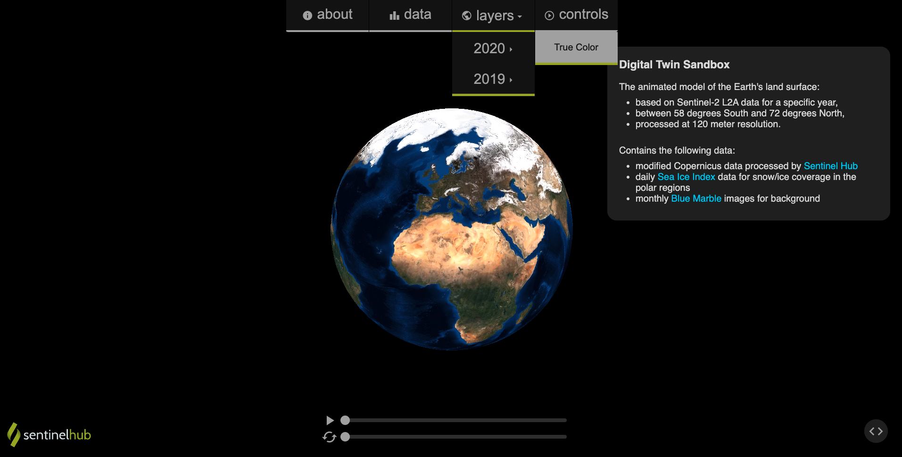

# Global Timelapse

This app displays an interactive simulation of our planet showing multiple layers to choose from. The layers correspond to yearly data.

## Instructions

1. Fork and clone this repo
2. Run npm install
3. Run npm start

## Credits
This app is based on: https://medium.com/@jcaron27/tutorial-build-an-interactive-virtual-globe-with-three-js-33cf7c2090cb
